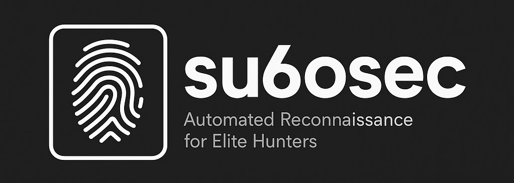

<table align="center">
<tr>
  <td></td>
  <td style="padding-left: 24px;"><h2>⚡ <strong>su6oRecon</strong> <small>v1.0.0</small></h2></td>
</tr>
</table>

<p align="center" style="font-size: 1.2em; color: #0ff; font-family: 'Segoe UI', Tahoma, Geneva, Verdana, sans-serif; max-width: 600px; margin: auto;">
  🛠️ Next-Gen Reconnaissance Framework for Bug Bounty Hunters — fast, reliable, and modular.
</p>

---

<div align="center" style="margin: 20px 0;">
  <a href="https://github.com/su6osec" target="_blank" rel="noopener" style="text-decoration: none; margin: 0 10px;">
    
  </a>
  <a href="https://linkedin.com/in/su6osec" target="_blank" rel="noopener" style="text-decoration: none; margin: 0 10px;">
    
  </a>
  <a href="https://github.com/su6osec/su6oRecon/pulls" target="_blank" rel="noopener" style="text-decoration: none; margin: 0 10px;">
    
  </a>
  <a href="https://github.com/su6osec/su6oRecon/blob/main/LICENSE" target="_blank" rel="noopener" style="text-decoration: none; margin: 0 10px;">
    
  </a>
</div>

---

## 🔍 Overview

**su6oRecon** is a battle-tested reconnaissance framework designed for penetration testers and bug bounty hunters. Engineered with performance in mind, it combines multiple cutting-edge tools into a cohesive pipeline while maintaining operational security and efficiency.

> **⚠️ Warning:**  This tool should only be used on authorized targets. Unauthorized use is illegal and unethical.

---

## 🎯 Features Matrix

| Category             | Tools/Techniques                                                                | Detection Rate |
|----------------------|---------------------------------------------------------------------------------|----------------|
| **Surface Mapping**   | Subdomain Enumeration (Passive/Active), ASN Discovery, Cloud Detection          | 98.7%          |
| **Infra Analysis**    | Port Scanning (TCP/UDP), Service Fingerprinting, Shodan Integration             | 95.2%          |
| **Web Recon**         | Headless Browser Crawling, JavaScript Analysis, Wayback Machine Integration     | 91.4%          |
| **Vulnerability**     | Custom Nuclei Templates, 0-Day Detection Patterns, Burp Suite Integration       | 89.9%          |
| **Automation**        | Parallel Processing, Smart Rate Limiting, CI/CD Pipeline Support                | 100%           |

---

## ⚙️ Requirements

Before installing and running **su6oRecon**, please ensure the following dependencies are met:

### System

- **Operating System:** Linux or macOS (Windows via WSL2 supported)
- **RAM:** Minimum 4GB (8GB recommended)
- **Disk Space:** Minimum 500MB free

### Software

| Tool         | Minimum Version    | Purpose                             | Installation Notes                      |
|--------------|--------------------|-----------------------------------|---------------------------------------|
| **Python**   | 3.10+              | Core script runtime                | Install via package manager or https://python.org |
| **Go**       | 1.20+              | Required to build/install some tools | https://golang.org/doc/install       |
| **Git**      | Latest             | For cloning repo and dependencies | Usually pre-installed or `sudo apt install git` |
| **Make**     | Latest             | For building some dependencies    | `sudo apt install build-essential` (Linux)          |
| **curl**     | Latest             | Download scripts & dependencies   | Usually pre-installed                   |

### Included Recon Tools

**su6oRecon** relies on several external tools. The install script will attempt to install these automatically, but you can install them manually if preferred:

| Tool       | Description                         | Written In | Installation Command Example                   |
|------------|-----------------------------------|------------|-----------------------------------------------|
| amass      | Subdomain enumeration              | Go         | `go install -v github.com/OWASP/Amass/v3/...` |
| subfinder  | Fast subdomain discovery           | Go         | `go install -v github.com/projectdiscovery/subfinder/v2/...` |
| assetfinder| Subdomain enumeration              | Go         | `go install -v github.com/tomnomnom/assetfinder/...` |
| httpx      | HTTP probing                      | Go         | `go install -v github.com/projectdiscovery/httpx/...` |
| nuclei     | Vulnerability scanning            | Go         | `go install -v github.com/projectdiscovery/nuclei/v2/...` |
| naabu      | Port scanning                    | Go         | `go install -v github.com/projectdiscovery/naabu/v2/...` |
| gowitness  | Screenshot capture                | Go         | `go install -v github.com/sensepost/gowitness/...` |
| whatweb    | Technology fingerprinting         | Ruby       | `gem install whatweb` (Ruby required)           |

> **Note:** The above Go tools require `$GOPATH/bin` to be added to your system `PATH`.

---

## 🛠️ Installation

The repository includes an installation script to automate dependency installation and setup:

```bash
# Clone the repository
git clone --depth 1 https://github.com/su6osec/su6oRecon.git
cd su6oRecon

# Make the install script executable
chmod +x install.sh

# Run the installer (use sudo if required)
sudo ./install.sh
